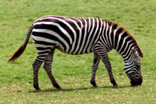

#  Super-Resolution x3

This repository is the implementation of CodaLab competitions [Super-Resolution](https://codalab.lisn.upsaclay.fr/competitions/622?secret_key=4e06d660-cd84-429c-971b-79d15f78d400). 

Result x3




## Fork from KAIR

[TrainingCode]https://github.com/cszn/KAIR

[SwinIR]https://github.com/JingyunLiang/SwinIR

## Requirements

To install requirements:

```setup
pip install -r requirements.txt
```

## Training

To train the model(s), run this command:

```train
python main_train_psnr.py --opt ./options/swinir/train_swinir_sr_classical.json
```

* scheduler use `MultiStepLR`
* optimizer  use `adam`, lr = 2e-4, weight_decay = 0
* Data augmentation(flipud, rot90)
* resi_connection use `3conv`
* H_size = 96
* loss_fn use `charbonnier`
* G_scheduler_milestones [25000, 40000, 45000, 47500, 50000]

## Reproduceing Submission(Inference)

[model link](https://drive.google.com/file/d/1G_Hi8NldnoFqP68rD_YRNPZPkAcDnIDp/view?usp=sharing)

```Inference
python main_test_swinir.py --task classical_sr --scale 3 --model_path <model_path> --folder_lq <folder_lq>
```

>📋 Will output `/results/*_pred.png`
## Pre-trained Models

No pre-trained model used

## Results

My model achieves the following performance on :

### Super-Resolution

| Model name         |       PSNR      |
| ------------------ |---------------- |
| My best model      |      28.2570    |


References
- [KAIR](https://github.com/cszn/KAIR)

- [SwinIR](https://github.com/JingyunLiang/SwinIR)
----------
```BibTex
@inproceedings{liang2021swinir,
title={SwinIR: Image Restoration Using Swin Transformer},
author={Liang, Jingyun and Cao, Jiezhang and Sun, Guolei and Zhang, Kai and Van Gool, Luc and Timofte, Radu},
booktitle={IEEE International Conference on Computer Vision Workshops},
year={2021}
}
```
